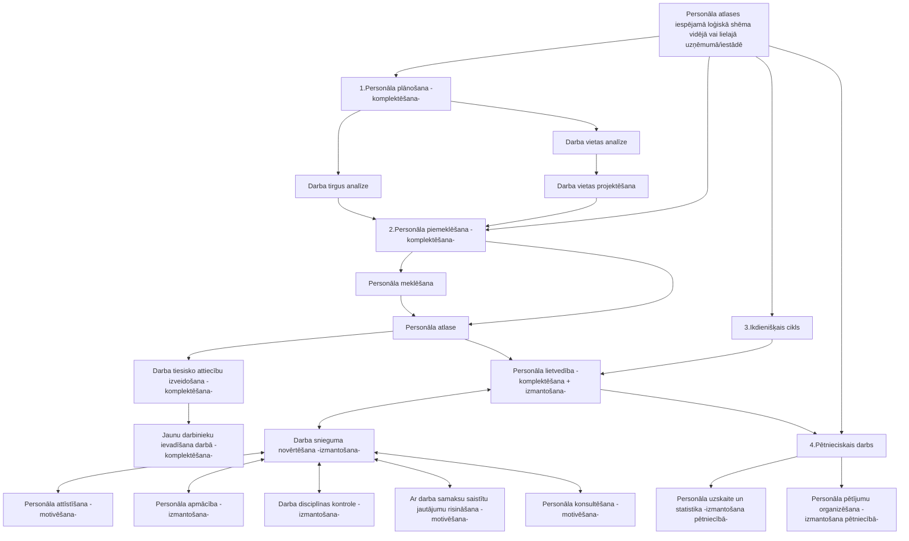

```mermaid
graph TD
    A[Personāla atlases iespējamā loģiskā shēma vidējā vai lielajā uzņēmumā/iestādē] --> B[1.Personāla plānošana -komplektēšana-]

    B --> E[Darba tirgus analīze]
    B --> F[Darba vietas analīze]
    F --> G[Darba vietas projektēšana]
    G --> C[2.Personāla piemeklēšana -komplektēšana-]
    E --> C
    A --> C
    C --> H[Personāla meklēšana]
    C --> I[Personāla atlase]
    H --> I

    I --> J[Darba tiesisko attiecību izveidošana -komplektēšana-]
    I --> L[Personāla lietvedība -komplektēšana + izmantošana-]
    J --> K[Jaunu darbinieku ievadīšana darbā -komplektēšana-]

    A --> U[3.Ikdienišķais cikls]
    U --> L

    L <--> M[Darba snieguma novērtēšana -izmantošana-]
    M <--> N[Personāla attīstīšana -motivēšana-]
    M <--> O[Personāla apmācība -izmantošana-]
    M <--> P[Darba disciplīnas kontrole -izmantošana-]
    M <--> Q[Ar darba samaksu saistītu jautājumu risināšana -motivēšana-]
    M <--> R[Personāla konsultēšana -motivēšana-]

    A -->D[4.Pētnieciskais darbs]
    L -->D
    D --> S[Personāla uzskaite un statistika -izmantošana pētniecībā-]
    D --> T[Personāla pētījumu organizēšana -izmantošana pētniecībā-]
```

